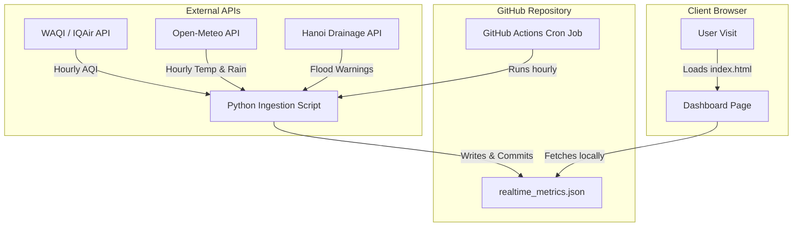

# Real-Time & Hourly-Updated Dashboard - Technical Implementation Plan

To evolve the current static Hanoi Urban Ecosystem Dashboard into a real-time system (updating hourly), we must bridge static datasets (LULC, Population) with dynamic APIs (AQI, Temperature, Rainfall, Water levels/Flood alerts).

Below is the architectural design, recommended API endpoints, and step-by-step implementation plan.

---

## 🏗️ Recommended Architectural Approaches

To keep the project **low-maintenance and cost-free (zero hosting fees)**, we recommend **Approach A (Serverless Cron Ingestion)**.



### Approach A: Serverless Data Pipeline (Recommended)
* **How it works**: A GitHub Actions workflow runs every hour via a cron job, triggers a Python script to query environmental APIs, updates a static JSON file (`data/realtime_metrics.json`), and commits it back to the repository.
* **Why it's best**: 100% free hosting on GitHub Pages, hides private API keys in GitHub Secrets, eliminates client-side CORS and rate-limiting issues, and loads instantly for users.

### Approach B: Client-Side Live Fetching
* **How it works**: When a user opens the page, their browser directly sends API requests (e.g., to Open-Meteo and World Air Quality Index APIs) and renders the response.
* **Pros**: Instantly live, no repository commits.
* **Cons**: Exposes private API keys to the browser, rate-limits users behind public IPs, and presents CORS blockages.

---

## 🔌 Real-Time Data Sources & API Mapping

| Parameter | Metric Type | Suggested API Provider | Update Frequency | Vietnamese Context / Coordinates |
| :--- | :--- | :--- | :--- | :--- |
| **Air Quality** | Hourly AQI ($PM_{2.5}$) | [World Air Quality Index (WAQI) API](https://aqicn.org/api/) | Hourly | Queries stations in Hanoi (e.g., Hoan Kiem, Cau Giay, US Embassy). |
| **Surface Temp (LST Proxy)** | Hourly Air & Ground Temp | [Open-Meteo Free Weather API](https://open-meteo.com/) | Hourly | Coordinates: `21.0285, 105.8542` (Hanoi Central). |
| **Rainfall / Infiltration** | Hourly Rain Volume (mm) | [Open-Meteo Weather API](https://open-meteo.com/) | Hourly | Correlates high rainfall with flood warning triggers in high concrete zones. |
| **Flood Points** | Active Waterlogged Sites | [Hanoi Drainage App / Cliflo App API](http://thoatnuochanoi.vn/) (Internal or Scraped) | Real-time | Detects active sewer overflow/inundation points. Alternately, crowdsourced reporting / Telegram bot. |

---

## 🛠️ Step-by-Step Implementation Steps (Approach A)

### Phase 1: Create the Ingestion Script
Create a Python script `ingest_realtime.py` in the workspace to retrieve and structure the hourly metrics:

```python
import os
import json
import requests

# 1. Configuration
HANOI_LAT, HANOI_LON = 21.0285, 105.8542
WAQI_TOKEN = os.getenv("WAQI_API_TOKEN") # Stored in Github Secrets

def fetch_aqi():
    # Fetch live AQI for Hanoi region
    url = f"https://api.waqi.info/feed/geo:{HANOI_LAT};{HANOI_LON}/?token={WAQI_TOKEN}"
    res = requests.get(url).json()
    return res['data']['aqi'] if res['status'] == 'ok' else 100

def fetch_weather():
    # Fetch hourly air & soil surface temperature + rainfall
    url = f"https://api.open-meteo.com/v1/forecast?latitude={HANOI_LAT}&longitude={HANOI_LON}&hourly=temperature_2m,soil_temperature_0cm,rain&forecast_days=1"
    res = requests.get(url).json()
    # Get current hour's values
    current_hour_idx = 0 # Match with local hour
    return {
        "air_temp": res['hourly']['temperature_2m'][current_hour_idx],
        "lst_proxy": res['hourly']['soil_temperature_0cm'][current_hour_idx],
        "rain": res['hourly']['rain'][current_hour_idx]
    }

def main():
    aqi = fetch_aqi()
    weather = fetch_weather()
    
    # Save structured dynamic payload
    data = {
        "last_updated": "2026-06-30T16:30:00Z", # Current timestamp
        "metro": {
            "aqi": aqi,
            "lst": weather["lst_proxy"],
            "hourly_rain_mm": weather["rain"]
        },
        # Distribute metrics to districts based on baseline scale models
        "districts": {} 
    }
    
    with open("Dashboard/data/realtime_metrics.json", "w") as f:
        json.dump(data, f, indent=4)

if __name__ == "__main__":
    main()
```

### Phase 2: Configure GitHub Actions Workflow
Create a workflow file `.github/workflows/hourly_ingest.yml` in your repository:

```yaml
name: Hourly Real-Time Data Ingestion

on:
  schedule:
    - cron: '0 * * * *' # Executes at the start of every hour
  workflow_dispatch: # Allows manual trigger

jobs:
  update-data:
    runs-on: ubuntu-latest
    steps:
      - name: Checkout Repository
        uses: actions/checkout@v3

      - name: Setup Python
        uses: actions/setup-python@v4
        with:
          python-version: '3.10'

      - name: Install Dependencies
        run: pip install requests

      - name: Fetch Real-Time Data
        env:
          WAQI_API_TOKEN: ${{ secrets.WAQI_API_TOKEN }}
        run: python ingest_realtime.py

      - name: Commit and Push Changes
        run: |
          git config --global user.name "github-actions[bot]"
          git config --global user.email "41898282+github-actions[bot]@users.noreply.github.com"
          git add Dashboard/data/realtime_metrics.json
          git diff-index --quiet HEAD || git commit -m "chore: hourly real-time data update"
          git push
```

### Phase 3: Modify Dashboard Frontend (`index.html`)
Update the dashboard frontend to load this dynamically generated JSON file:

```javascript
// Replace static declarations with an asynchronous loader
async function loadRealtimeData() {
    try {
        const response = await fetch('data/realtime_metrics.json');
        const realtime = await response.json();
        
        // Update local variables with live API readings
        metroTotals.aqi = realtime.metro.aqi;
        metroTotals.lst = realtime.metro.lst;
        
        // Refresh dashboard views
        switchTheme(currentTheme);
        console.log("Realtime metrics synced successfully!");
    } catch (err) {
        console.warn("Realtime fetch failed; falling back to compiled statistics.", err);
        // baseline statistics remain active as fallback
    }
}

// Call on startup
window.onload = () => {
    loadRealtimeData();
    setInterval(loadRealtimeData, 1000 * 60 * 15); // refresh client-side every 15 minutes
};
```
